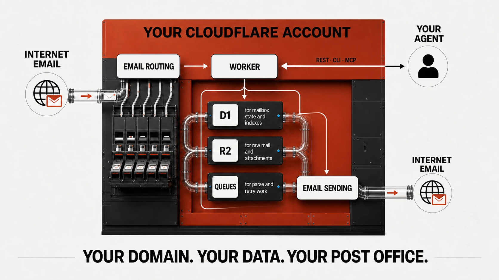

# Agent Post Office

[](https://github.com/Agent-Post-Office/agentpostoffice-cloudflare/actions/workflows/ci.yml)

## Get it running with your agent

1. Put your domain on Cloudflare and enable [Workers Paid](https://developers.cloudflare.com/workers/platform/pricing/) (minimum $5 USD/month).
2. Sign in from your terminal:

   ```bash
   npx wrangler login
   ```

3. Give your favorite coding agent this prompt:

   > Install Agent Post Office from `https://github.com/Agent-Post-Office/agentpostoffice-cloudflare` for `<your-domain>`. Create mailboxes `<your-mailboxes>`. Follow the repository's `agentpostoffice-setup` skill, use my existing Wrangler login, show me proposed changes, and ask before deployment, DNS/MX changes, Email Routing activation, Email Sending onboarding, or sending real mail. Do not ask me to paste API tokens into chat.

That is the normal installation path. The rest of this README explains what the agent does and provides a manual fallback.

### How it works



> **Developer preview:** The live receive, send, reply, authentication, and safe-download happy paths have been exercised, but the full failure-injection and deliverability matrix in [Phase 0](./docs/PHASE-0.md) is still in progress. Do not use this preview as the only copy of business-critical mail.

Agent Post Office is an open-source, self-hosted email service for agents. It runs inside the operator's Cloudflare account, receives mail for one custom domain, exposes a pull-based REST API, and sends transactional mail and replies.

The Phase 1 implementation is test-covered, and a live deployment has proved the active-recipient receive, parse, poll, and acknowledge happy path. The remaining mandatory Cloudflare Phase 0 gates are not complete, so the project should not yet be treated as production-ready. See [the architecture plan](./AGENTPOSTOFFICE-PLAN.md), [installation guide](./docs/INSTALL.md), and [live proof checklist](./docs/PHASE-0.md).

## Monorepo

| Package | Purpose |
| --- | --- |
| `@agentpostoffice/worker` | Email Worker, REST API, D1 schema, R2 persistence, Queue parsing/deletion, Email Sending. |
| `@agentpostoffice/client` | Typed REST client used by the CLI and MCP server. |
| `@agentpostoffice/cli` | Credential-aware mailbox/message/send/reply CLI. |
| `@agentpostoffice/mcp` | Bounded MCP tools with explicit untrusted-content labels. |
| `@agentpostoffice/openapi` | OpenAPI 3.1 contract. |

## What is implemented

- Catch-all Email Worker logic that validates the SMTP envelope recipient against active D1 inboxes.
- A 10 MiB application limit, byte-exact raw MIME persistence to private R2, D1 ingestion state, and ID-only Queue tasks.
- Idempotent `postal-mime` Queue parsing, 8 KiB UTF-8 excerpts, private complete bodies, attachment checksums, and DLQ-to-`parse_failed` handling.
- Scoped SHA-256 bearer-token authentication with constant-time digest comparison.
- Inbox CRUD; domain-wide keyset polling; message get/acknowledge/raw/attachment/delete; explicit-ID bulk deletion.
- Transactional send and reply with required idempotency keys and `accepted`, `failed`, or `unknown` outcomes.
- A shared client, local CLI, MCP server, versioned D1 migration, OpenAPI contract, and repo-local setup skill.

All email bodies, subjects, headers, links, and attachments are untrusted. The service does not render HTML, open downloads, scan malware, promise exactly-once processing, or claim delivery after Cloudflare accepts a send.

## Preview limitations

- Live R2, D1, and Queue failure injection, retry, duplicate, orphan, and DLQ behavior are still being characterized.
- Near-limit MIME/parser behavior and active HTML/SVG download checks are not yet fully proved live.
- Bounce, suppression, soft-retry, and delivery-event synchronization remain incomplete.
- Installation still requires a Cloudflare account, a domain on Cloudflare DNS, Email Routing, and Email Sending eligibility.

See [the complete Phase 0 matrix](./docs/PHASE-0.md) for current proof boundaries. Security issues should be reported privately according to [SECURITY.md](./SECURITY.md); contributions are described in [CONTRIBUTING.md](./CONTRIBUTING.md).

## Security roadmap and cost watch

**APO-SEC-005 is an accepted MVP risk.** A public Worker can receive valid-looking invalid bearer tokens that still cause D1 lookups, and a known active mailbox can receive repeated large messages that consume Workers, R2, D1, and Queue resources. Application quotas, spam filtering, and automatic traffic blocking remain roadmap work rather than hidden MVP behavior.

Roadmap items:

- configurable per-domain and per-mailbox ingress/storage budgets;
- platform or application rate limits for repeated authentication failures;
- retention controls and operator-visible usage breakdowns;
- tested emergency controls that distinguish API abuse from inbound-mail abuse without silently losing mail.

Before production use, configure Cloudflare cost monitoring:

1. Decide the maximum **usage-based overage** you are willing to pay in one billing cycle. Fixed-fee subscriptions are not included in Cloudflare's Billable Usage view.
2. In Cloudflare, open **Manage Account > Billing > Billable Usage > Create budget alert**. Create at least three account-wide email alerts at roughly 50%, 80%, and 100% of that overage tolerance, and include a second operator address where practical. Cloudflare currently offers these alerts to pay-as-you-go accounts, not Enterprise contract accounts. See [Cloudflare's budget-alert instructions](https://developers.cloudflare.com/billing/manage/budget-alerts/).
3. If the account's plan exposes per-product usage notifications, open **Notifications > Add > Billable Usage** and add thresholds for the available Workers, R2, D1, and Queues metrics. Product choices and thresholds depend on the plan and current Cloudflare UI; do not assume every metric is offered. See [usage-based billing notifications](https://developers.cloudflare.com/billing/understand/usage-based-billing/#usage-based-billing-notifications).
4. Review **Billable Usage** weekly and filter the daily cost chart by Workers, R2, D1, and Queues. A sudden change in one product is more actionable than the account total alone. See [Cloudflare's billable-usage dashboard guide](https://developers.cloudflare.com/billing/manage/billable-usage/).

Budget alerts are informational: they do not pause, cap, or stop usage. When an alert fires, identify the product and first spike date in Billable Usage, then inspect Workers request/error metrics, R2 storage and operations, D1 activity, and Queue backlog. Rotate an Agent Post Office token only when there is evidence of credential misuse. For inbound-mail abuse, disable only the affected mailbox when possible; pausing the Email Routing catch-all is an operator-approved emergency action because it affects every mailbox on the domain. Never copy message content or raw addresses into incident evidence.

## Development

Requirements: Node.js 20+ and npm.

```bash
npm install
npm test
npm run check
npm run build
```

The test suite has two gates:

- Node unit tests for boundary normalization, bearer handling, the client, and SMTP persistence failure ordering.
- Cloudflare workerd integration tests with real local D1 and R2 bindings for migrations, keyset pagination, tombstones, download headers, MIME parsing, attachment storage, queue redelivery, and idempotency replay.

TDD is mandatory for new behavior; see [AGENTS.md](./AGENTS.md).

## Configure Cloudflare application resources

Do not run this against an account until you have reviewed [docs/INSTALL.md](./docs/INSTALL.md) and [docs/PHASE-0.md](./docs/PHASE-0.md).

The installation guide offers two supported Cloudflare setup paths:

1. **Manual dashboard path:** the operator reviews and confirms Email Sending, Email Routing, DNS, and the catch-all-to-Worker rule in the Cloudflare dashboard.
2. **Agent-assisted path:** a local agent uses Wrangler and a scoped Cloudflare credential to provision and deploy resources, prints the proposed routing changes, and pauses for explicit approval before changing DNS or routing.

Both paths use the same self-hosted Worker, D1, R2, Queue, and application-token setup. The difference is who performs the Cloudflare Email Service onboarding. Manual DNS entry is not recommended because Cloudflare generates the DKIM key and manages the Email Service records.

```bash
npm run config:generate -- --mail-domain mail.example.com
```

The helper authenticates Wrangler, inspects/reuses or creates D1, R2, Queue, and DLQ resources, writes the ignored `packages/worker/wrangler.jsonc`, and applies migrations. It does not silently activate MX or routing.

See [Agent Post Office installation](./docs/INSTALL.md#choose-a-cloudflare-setup-path) for the dashboard walkthrough, agent prompt contract, Wrangler commands, permissions, and approval boundaries.

## Agent-assisted Cloudflare setup

The repository includes the `agentpostoffice-setup` skill so an operator can give a local agent the repository path, exact mail domain, intended mailbox local parts, and a scoped Cloudflare credential. The agent must show every live change and stop for approval before deployment, DNS/MX changes, Email Routing activation, Email Sending onboarding, or a real message.

Interactive Wrangler OAuth is simplest:

```bash
npx wrangler login
npx wrangler whoami
```

A custom API token must be restricted to the intended account and zone. The setup path needs Workers Scripts, D1, R2, Queues, Email Sending, Zone Read, Zone Settings, and Email Routing Rules edit capabilities. General DNS Edit is only needed when the agent must directly replace an existing non-Cloudflare record. Never paste the token into chat, source, Wrangler variables, or evidence files.

Run the local gates before touching Cloudflare:

```bash
npm install
npm test
npm run check
npm run build
```

Then provision or reuse resources:

```bash
npm run config:generate -- --mail-domain example.com
```

Review the ignored `packages/worker/wrangler.jsonc`. Confirm the Worker name, full `MAIL_DOMAIN`, D1 ID, R2 bucket, Queue, DLQ, and Email Sending binding. Existing resources should be reused; renaming the product must not silently recreate storage or lose mailbox state.

Deploy and bootstrap the local credential:

```bash
npm run deploy
npm --workspace @agentpostoffice/worker run migrate:remote
```

There is no token-management npm script or application API. Follow the agent-operated Wrangler procedure in [docs/INSTALL.md](./docs/INSTALL.md#5-deploy-migrate-and-create-an-application-token): generate the credential locally without printing it, insert only its digest and metadata into D1 with Wrangler, and pipe the raw value through `--token-stdin` directly into the operating-system credential store.

Create every intended mailbox before routing mail:

```bash
node packages/cli/dist/index.js inboxes create contact --display-name "Contact"
node packages/cli/dist/index.js inboxes create support --display-name "Support"
node packages/cli/dist/index.js inboxes list
```

Do not invent these local parts for an operator. Unknown and disabled recipients are rejected by the Worker.

### Inbound Email Routing cutover

Using an apex domain replaces its current inbound provider for every address on that domain. A dedicated mail subdomain is safer when an existing provider must remain active.

Before enabling routing, show:

- the current public MX records;
- the three Cloudflare routing MX records;
- Cloudflare's managed routing SPF and DKIM records;
- the enabled catch-all Worker action targeting `agentpostoffice`;
- every existing MX record that will be removed.

Cloudflare refuses managed routing activation while a non-Cloudflare apex MX exists. Remove only the explicitly approved conflicting MX, enable routing immediately, and restore the previous MX if activation fails. Verify both Cloudflare state and public DNS afterward.

Wrangler 4.110.0 has an important limitation: it rejects `worker` actions for catch-all rules in local argument validation even though Cloudflare's Email Routing API accepts them. Configure the catch-all Worker action through the dashboard or supported API; do not substitute a `drop` or forwarding rule.

### Outbound Email Sending onboarding

Email Routing does not enable arbitrary-recipient sending. Until Email Sending is onboarded, Cloudflare may return `E_RECIPIENT_NOT_ALLOWED` for replies to unverified destinations.

Use **Email Service > Email Sending > Onboard Domain** and leave the subdomain blank to send from the apex. Expand **Review DNS records that will be added** before selecting **Done**. Cloudflare currently proposes:

- three bounce MX records at `cf-bounce.<domain>`;
- bounce SPF at `cf-bounce.<domain>`;
- managed DKIM at `cf-bounce._domainkey.<domain>`;
- a DMARC record at `_dmarc.<domain>`.

Stop if `_dmarc.<domain>` already exists. Decide explicitly whether to preserve reporting destinations such as `rua=mailto:...`, merge them into the proposed policy, or replace the record. Two DMARC records are invalid, and onboarding must not silently discard an existing reporting address.

Cloudflare generates the outbound `Message-ID`; Agent Post Office must not submit a custom one. Threaded replies preserve allowed `In-Reply-To` and `References` headers.

### Mandatory live proof

After DNS propagation, send a non-sensitive test from an external provider. Poll, inspect, and acknowledge it without copying sender, recipient, subject, or body into evidence:

```bash
node packages/cli/dist/index.js messages list --state unprocessed --direction inbound
node packages/cli/dist/index.js messages get <message-id>
node packages/cli/dist/index.js messages ack <message-id>
```

Then make an explicitly approved threaded reply with a fresh idempotency key:

```bash
node packages/cli/dist/index.js reply <message-id> \
  --text "Received successfully." \
  --idempotency-key <unique-key>
```

Never reuse an idempotency key after a failed or uncertain attempt. `accepted` means Cloudflare accepted the send, not that the destination delivered it. Complete every gate in [docs/PHASE-0.md](./docs/PHASE-0.md), including SPF/DKIM/DMARC header verification, unknown-recipient rejection, failure injection, MIME fidelity, real reply threading, and delivery observability.

### Setup troubleshooting

| Symptom | Meaning and action |
| --- | --- |
| `Non-Cloudflare MX records exist` | Cloudflare will not enable routing until the approved conflicting apex MX is removed. Use rollback protection. |
| Catch-all CLI says only `forward` or `drop` is supported | Use the dashboard or Email Routing API for the catch-all `worker` action. |
| `Provided readable stream must have a known length` | An old Worker build passed the inbound stream directly to R2. Deploy the fixed build, which materializes the size-bounded stream into exact fixed-size bytes. |
| Cloudflare activity says the Worker threw a temporary exception | Inspect Workers Observability. Do not convert infrastructure failures into permanent `setReject()` policy failures. |
| `custom header 'Message-ID' is not allowed` | Deploy the fixed reply builder and let Cloudflare generate `Message-ID`. |
| `E_RECIPIENT_NOT_ALLOWED` | Email Sending is not onboarded for arbitrary-recipient delivery, or the account lacks the required entitlement. Review onboarding and plan eligibility. |
| A test is absent after an MX cutover | The sender may cache the previous MX for its TTL. Check Cloudflare's routing activity before assuming DNS failed. |

Create, list, scope, expire, and revoke application tokens through the agent-operated Wrangler D1 procedure in [docs/INSTALL.md](./docs/INSTALL.md#5-deploy-migrate-and-create-an-application-token). Agent Post Office application code only reads token rows. Raw tokens must never appear in command arguments, chat, logs, or evidence.

## Basic API use

```bash
curl -sS https://agentpostoffice.example.workers.dev/v1/messages?state=unprocessed\&order=asc\&limit=25 \
  -H "Authorization: Bearer $AGENTPOSTOFFICE_TOKEN"
```

A message remains `unprocessed` until explicitly acknowledged:

```bash
curl -sS -X PATCH https://agentpostoffice.example.workers.dev/v1/messages/msg_123 \
  -H "Authorization: Bearer $AGENTPOSTOFFICE_TOKEN" \
  -H "Content-Type: application/json" \
  --data '{"state":"processed"}'
```

Send and reply requests require an `Idempotency-Key`. Reusing the key with different content returns a conflict; once an attempt begins, that key never sends again.

## MCP

Run the built server with credentials in its environment:

```bash
AGENTPOSTOFFICE_URL=https://agentpostoffice.example.workers.dev \
AGENTPOSTOFFICE_TOKEN='apo_<key-id>_<secret>' \
AGENTPOSTOFFICE_DOWNLOAD_DIR="$HOME/Downloads/agentpostoffice" \
node packages/mcp/dist/index.js
```

MCP message output is labeled `untrusted_content: true`. Attachment metadata can be inspected without downloading. The explicit save tools require `confirmed: true`, accept only a filename, and create a new `0600` file inside `AGENTPOSTOFFICE_DOWNLOAD_DIR`; they never open the saved bytes. Before creating an attachment file, MCP verifies the downloaded byte length and SHA-256 checksum against stored metadata. The download directory defaults to `~/Downloads/agentpostoffice`.

## Production status

Local tests cannot establish Cloudflare's real SMTP failure/retry semantics, Email Sending entitlement, SPF/DKIM/DMARC results, or delivery observability. Those claims remain blocked on the live, disposable-domain Phase 0 run. Do not mark setup complete until every gate in [docs/PHASE-0.md](./docs/PHASE-0.md) has evidence.
